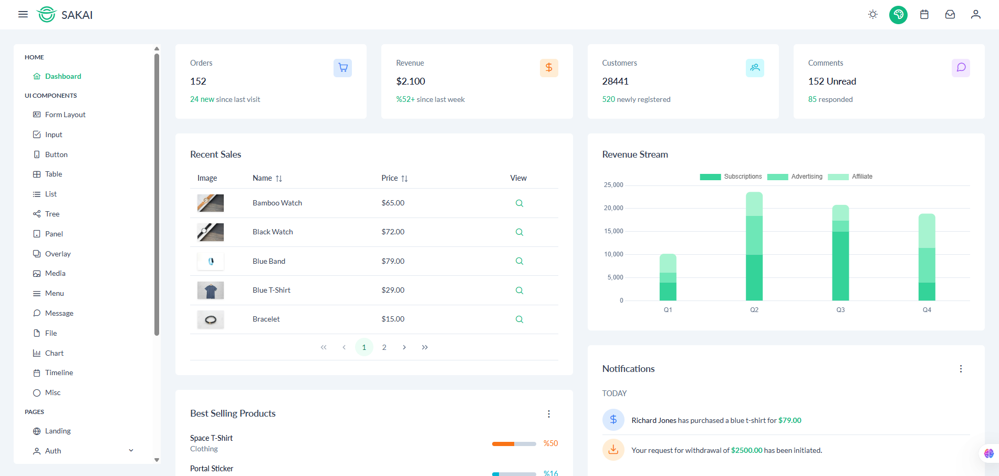

# Admin Layout Feature Specifications

## Authentication Components

### Admin Token Management

-   Create a composable `useAdminAuth` to handle admin authentication
-   Methods:
    -   `checkAdminToken(): boolean` - Verify existence of `mbp_admin_token` in localStorage
    -   `validateAdminToken(): Promise<boolean>` - Send token to backend for validation
    -   `clearAdminToken(): void` - Remove admin token from localStorage

### Login Page (`/admin/login`)

-   Component: `MAdminLogin`
-   Features:
    -   Username input field
    -   Password input field
    -   Login button
    -   Development mode: Allow empty credentials for successful login
    -   Production mode: Validate credentials against backend

## Layout Components

### Admin Layout (`AdminLayout.vue`)

-   Core layout wrapper component
-   Structure:
    -   Header component
    -   Sidebar component
    -   Main content area with `<router-view>`
-   Features:
    -   Responsive design using Tailwind CSS
    -   Mobile-friendly layout adjustments

### Sidebar Component (`MSidebar.vue`)

-   Width: 300px
-   Features:
    -   MBP logo at top
    -   Navigation menu with PrimeVue components
    -   Collapsible category items with sub-items
    -   Active state highlighting
-   Navigation Items:
    ```typescript
    interface NavItem {
    	label: string;
    	icon: string;
    	to?: string;
    	items?: NavItem[];
    }
    ```
-   Menu Structure:
    -   MCs and Clients (`/admin/mc`)
    -   Posts (`/admin/post`)
    -   Categories
        -   MC Types (`/admin/category/mc-type`)
        -   Hosting Styles (`/admin/category/hosting-style`)
    -   Role Management
        -   Employees (`/admin/role-management/employee`)
        -   Roles (`/admin/role-management/role`)
    -   System
        -   Activity Logs (`/admin/system/activity-log`)

### Header Component (`MAdminHeader.vue`)

-   Height: 60px
-   Features:
    -   Account dropdown menu in top-right corner
    -   User profile icon
    -   Dropdown Items:
        -   Account Information
        -   Change Password (admin only)
        -   Logout

## Routing Setup

### Route Guards

-   Create navigation guard to check authentication:
    ```typescript
    router.beforeEach(async (to, from, next) => {
    	if (to.path.startsWith("/admin") && to.path !== "/admin/login") {
    		const isAuthenticated = await validateAdminToken();
    		if (!isAuthenticated) {
    			next("/admin/login");
    			return;
    		}
    	}
    	next();
    });
    ```

### Route Configuration

-   Define admin routes in separate routing module:
    ```typescript
    const adminRoutes = [
    	{
    		path: "/admin",
    		component: AdminLayout,
    		children: [
    			{
    				path: "",
    				name: "admin-dashboard",
    				component: () => import("@/views/admin/Dashboard.vue"),
    			},
    			// ... other admin routes
    		],
    	},
    ];
    ```

## Placeholder Pages

Create basic placeholder pages for each route showing only the page name:

-   MCManagement.vue
-   PostManagement.vue
-   MCTypeManagement.vue
-   HostingStyleManagement.vue
-   EmployeeManagement.vue
-   RoleManagement.vue
-   ActivityLogManagement.vue

Each placeholder should display a simple text indicating the current page name until full implementation is ready.

## Style Guidelines

-   Use PrimeVue's Sakai theme as reference
-   Follow mobile-first responsive design
-   Implement consistent spacing and padding
-   Use Tailwind CSS for custom styling
-   Ensure all components follow the 'M' prefix naming convention
-   Use TypeScript for all component and utility definitions

## Error Handling

-   Implement error boundaries for each major component
-   Display appropriate error messages for:
    -   Authentication failures
    -   Network errors
    -   Invalid routes
-   Use PrimeVue's Toast component for error notifications

## Performance Considerations

-   Implement lazy loading for all route components
-   Use Suspense for async components
-   Optimize bundle size through code splitting
-   Cache frequently accessed data
-   Implement proper cleanup in component unmount hooks

## Layout sample


